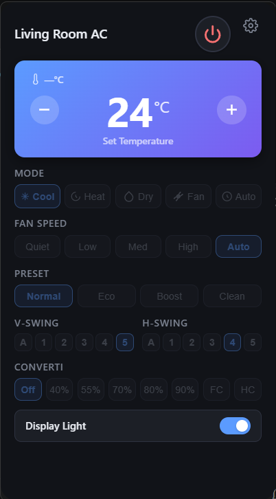

# miraie-desktop

A system tray desktop app to control your **Panasonic MirAIe smart AC** from Windows/macOS/Linux — built with [Tauri](https://tauri.app), TypeScript, and a Python sidecar powered by the [`miraie-ac`](https://github.com/rkzofficial/miraie-ac) library.




---

## Features

- 🔌 **Power** on/off from the system tray
- 🌡️ **Temperature** adjustment (16°C – 30°C)
- ❄️ **HVAC mode** — Cool, Heat, Dry, Fan, Auto
- 💨 **Fan speed** — Quiet, Low, Medium, High, Auto
- 🎯 **Preset mode** — Normal, Eco, Boost, Clean
- 🔄 **Vertical & Horizontal swing** (Auto + positions 1–5)
- ⚡ **Converti7 mode** — Off, 40%, 55%, 70%, 80%, 90%, FC, HC
- 💡 **Display light** toggle
- 🌗 Automatic **light/dark mode**

---

## Prerequisites

Make sure the following are installed before you begin.

| Tool                             | Version | Notes                                                                               |
| -------------------------------- | ------- | ----------------------------------------------------------------------------------- |
| [Node.js](https://nodejs.org)    | ≥ 18    |                                                                                     |
| [pnpm](https://pnpm.io)          | ≥ 9     | `npm i -g pnpm`                                                                     |
| [Rust](https://rustup.rs)        | stable  | `rustup install stable`                                                             |
| [Python](https://python.org)     | 3.14    | As specified in `python-api/.python-version`                                        |
| [uv](https://docs.astral.sh/uv/) | latest  | Python package manager — `pip install uv`                                           |
| Tauri CLI prerequisites          | —       | See [Tauri v2 prerequisites](https://v2.tauri.app/start/prerequisites/) for your OS |

> [!NOTE]
> The Python sidecar uses [`miraie-ac`](https://github.com/rkzofficial/miraie-ac) — an unofficial Python library for the Panasonic MirAIe MQTT API. Your AC must be already set up and connected to the MirAIe cloud via the official app.

---

## Getting Started

### 1. Clone the repository

```bash
git clone https://github.com/your-username/miraie-desktop.git
cd miraie-desktop
```

### 2. Install frontend dependencies

```bash
pnpm install
```

### 3. Set up the Python environment

```bash
cd python-api
uv sync
```

### 4. Build the Python sidecar binary

PyInstaller packages the Python API into a standalone executable that Tauri bundles alongside the app.

```bash
# From the python-api directory
.venv\Scripts\pyinstaller.exe main.spec --distpath dist --workpath build --noconfirm
```

> On macOS/Linux use `.venv/bin/pyinstaller` instead.

### 5. Copy the binary to the Tauri bin directory

**Windows (x86_64):**

```powershell
Copy-Item "dist\main.exe" "..\src-tauri\bin\python-api-x86_64-pc-windows-msvc.exe" -Force
```

**macOS (Apple Silicon):**

```bash
cp dist/main ../src-tauri/bin/python-api-aarch64-apple-darwin
```

**macOS (Intel):**

```bash
cp dist/main ../src-tauri/bin/python-api-x86_64-apple-darwin
```

**Linux (x86_64):**

```bash
cp dist/main ../src-tauri/bin/python-api-x86_64-unknown-linux-gnu
```

---

## Commands

All commands below are run from the **project root** unless noted.

### Dev — run in development mode

```bash
pnpm tauri dev
```

Starts Vite for hot-reload frontend + the Tauri shell. The Python sidecar binary must already be built and placed in `src-tauri/bin/` (see Getting Started step 4–5).

### Build — produce a release bundle

```bash
pnpm tauri build
```

Compiles the frontend, compiles Rust, and packages everything (including the sidecar binary) into a native installer under `src-tauri/target/release/bundle/`.

### Frontend only (no Tauri shell)

```bash
pnpm dev       # Vite dev server at http://localhost:1420
pnpm build     # TypeScript compile + Vite build → dist/
pnpm preview   # Preview the built frontend
```

### Rebuild the Python sidecar

Run this any time you change `python-api/src/python_api/main.py`:

```bash
cd python-api
.venv\Scripts\pyinstaller.exe main.spec --distpath dist --workpath build --noconfirm
Copy-Item "dist\main.exe" "..\src-tauri\bin\python-api-x86_64-pc-windows-msvc.exe" -Force
```

---

## Configuration

On first launch, click the **⚙ Settings** gear icon in the top-right corner of the tray popup and enter your:

- **Mobile number** — the phone number registered with the MirAIe app (e.g. `+91 9876543210`)
- **Password** — your MirAIe account password

Credentials are stored in browser `localStorage` (Tauri's WebView storage) and persist across launches.

---

## Project Structure

```
miraie-desktop/
├── index.html               # Main UI (single page)
├── src/
│   ├── main.ts              # Frontend logic & Tauri invoke calls
│   └── styles.css           # UI styles (light/dark tokens)
├── src-tauri/
│   ├── src/
│   │   └── lib.rs           # Tauri commands (control_ac)
│   ├── bin/                 # Prebuilt Python sidecar binary (git-ignored)
│   └── tauri.conf.json      # Tauri app config (window size, sidecar, icons)
└── python-api/
    ├── src/python_api/
    │   └── main.py          # Python CLI — dispatches commands to miraie-ac
    ├── main.spec            # PyInstaller build spec
    └── pyproject.toml       # Python project & dependencies (uv)
```

---

## How It Works

```
User clicks button
      │
      ▼
  main.ts  ──invoke──▶  lib.rs (Tauri command)
                              │
                              ▼
                   python-api sidecar (PyInstaller exe)
                              │
                    miraie-ac Python library
                              │
                              ▼
                    MirAIe MQTT broker (mqtt.miraie.in)
                              │
                              ▼
                         Your AC unit
```

The desktop app communicates with the AC exclusively through the [`miraie-ac`](https://github.com/rkzofficial/miraie-ac) library, which handles authentication and MQTT messaging to Panasonic's MirAIe cloud.

---

## Recommended IDE Setup

- [VS Code](https://code.visualstudio.com/)
- [Tauri extension](https://marketplace.visualstudio.com/items?itemName=tauri-apps.tauri-vscode)
- [rust-analyzer](https://marketplace.visualstudio.com/items?itemName=rust-lang.rust-analyzer)

---

## Credits

- [`miraie-ac`](https://github.com/rkzofficial/miraie-ac) by [@rkzofficial](https://github.com/rkzofficial) — the unofficial Python API that makes this possible
- [Tauri](https://tauri.app) — the framework for building lightweight desktop apps with web frontends
